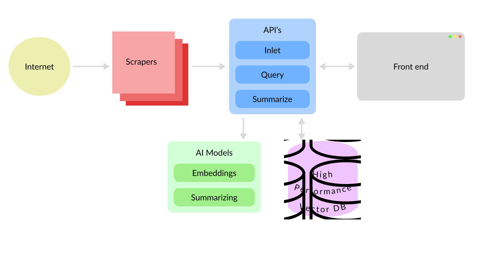

# Whisper

[Live here](https://whisper.tear.fi)

### Automated lead finding from internet sources with AI filtering

This project was made as a part of the [Junction 2023](https://junction2023.com) for the Outokumpu AI decision making challenge.

## Goal

The ultimate idea of this project is to scavenge the internet for information that might be relevant and then use advanced semantic and LLM methods to efficiently and smartly find the truly important bits that are useful for business decisions. For this PoC we chose to focus on finding new leads that the sales rep might not have found trough traditional means.

To reduce computational costs we make heavy use of the really efficient and fast semantic similarity vector searches. From those initial matches we run better AI models to figure out if the article is relevant or not. This way we can filter out a lot of the noise and only focus on the important data.

For data sources we scraped 30k news articles from global sources.

## Tech Stack



The project was created with efficiency and modularity in mind, which is why the project is split into multiple parts that are easy to swap out. The main parts are the following:

- Independent scrapers for different sources (Currently only different News api's)
- A central vector database for storing the scraped data in embeddings. Used for filtering and semantic searching.
- AI model independent solutions for creating the embeddings vectors and making an API for summarizing the articles.
- Node.js and Express backend that ties everything together.
- React SPA for the user interface.

## Scrapers

Currently the project only scrapes different free News API's manually, but going forward the goal would be to create scrapers for many different sources. Some examle of different sources would be Patent databases, company websites, social media, etc. They would also be run by cron jobs automatically, resulting in near realtime data streams and insights.

## Vector Database

The most important factor for choosing the vector database was speed, efficiency and self hosting. That's why we landed on [Milvus](https://milvus.io/), which is an open source vector database. It's one of the leading vector databases and very battle proven to handle large amounts of data. It also has a very nice API and a lot of convenient features like different indexing methods.

## AI Model

To make use of the powerful vector databases we need to create good embeddings with great semantic meaning. Some other considerations were the ability to run the model without a GPU and the ability to switch out the model easily if need be. For those reasons we chose [Transform.js](https://huggingface.co/docs/transformers.js/index) for the SDK. It's a javascript libary with create support for a wide range of Hugging Face models, which makes it very future proof.

For the model we chose the [bge-base-en-v1.5](https://huggingface.co/BAAI/bge-base-en-v1.5). It's currently one of the leading models in [MTEB](https://huggingface.co/spaces/mteb/leaderboard) leaderboards and offers phenomenal performance for it's size. It's faster than real time on a CPU and has a very small memory footprint making it ideal for our use case.

For summarizing we wanted to run our own model also and we chose the [bart-large-cnn](https://huggingface.co/facebook/bart-large-cnn) which is higly efficient and specialices in summarizing news articles. Sadly we couldn't get it up and running in time with enough resources for production, so we had to revert to OpenAI's services :(.

## Backend

The backend ties all the loose ends together. It's a Node.js and Express server that handles all the requests from the frontend and the scrapers. It also handles the communication with the vector database and the AI model. Nothing too fancy here.

## Frontend

Just your standard React SPA with [Chakra.js](https://chakra-ui.com/) for the UI.


## Running the project

The easiest way to get started is to run the [docker-compose.yml](./docker-compose.dev.yml)

```bash
docker compose -f docker-compose.dev.yml up --build -d
```